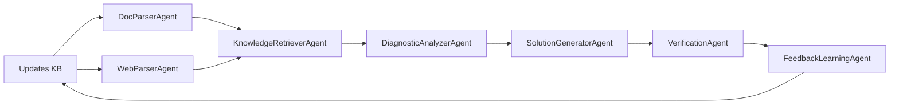

# AI‑Powered MATLAB Troubleshooter

This repository implements an agentic AI system for diagnosing and resolving MATLAB issues, built during our hackathon. It leverages multi‑agent orchestration to parse user queries, retrieve relevant documentation, analyze root causes, generate solutions, verify in MATLAB, and learn from feedback.

---

## Table of Contents

1. [Introduction](#introduction)
2. [Tech Stack](#tech-stack)
3. [Functioning of the Model](#functioning-of-the-model)
4. [Features](#features)
5. [Quick Start & Installation Guide](#quick-start--installation-guide)
6. [Code Snippets](#code-snippets)

---

## Introduction

AI‑Powered MATLAB Troubleshooter is a multi‑agent system designed to streamline the process of diagnosing and fixing MATLAB errors. Users submit natural‑language queries or upload error logs, documents, or screenshots. The system automatically:

* Parses the input
* Retrieves context from MATLAB docs, StackOverflow, and the web
* Analyzes the root cause
* Generates step‑by‑step solutions
* Verifies the fix in a live MATLAB session
* Learns from user feedback for continuous improvement

Our architecture uses a directed graph orchestrator (LangGraph) with specialized agents defined using CrewAI tools for modularity and scalability.

---

## Tech Stack

* **Orchestration:** LangGraph (graph‑based workflow engine)
* **Agent Framework:** CrewAI (role‑based multi‑agent orchestration)
* **Vector Store:** Chroma (embeddings storage and retrieval)
* **Embeddings:** GTE‑Small (`thenlper/gte-small`)
* **Reranker:** BGE Reranker (`BAAI/bge-reranker-base`)
* **LLMs:**

  * Google Gemini (`models/gemini-1.5-flash`, `GEMINI_API_KEY`)
  * Groq Models (e.g., `llama-3.3-70b-versatile` via GroqCloud)
* **MATLAB Integration:** MATLAB Engine API for Python
* **Frontend:** FastAPI (REST API) + optional Streamlit/Gradio UI

Configuration and dependencies are managed via a virtual environment and `requirements.txt`.

---

## Functioning of the Model



1. **DocParserAgent**: Ingests user‑uploaded files (PDFs, images) via OCR and document loaders.
2. **WebParserAgent**: Crawls live web content, forums, and community sites using CrewAI scraping tools.
3. **KnowledgeRetrieverAgent**: Executes advanced RAG with Chroma, combining sparse keyword and dense vector search, plus cross‑encoder reranking.
4. **DiagnosticAnalyzerAgent**: Uses RAG‑augmented LLM reasoning to pinpoint root causes.
5. **SolutionGeneratorAgent**: Generates MATLAB code edits or commands in natural language.
6. **VerificationAgent**: Runs and tests the solution via the MATLAB Engine API, capturing outputs or errors.
7. **FeedbackLearningAgent**: Collects user validation, updates vector store with successful Q\&A pairs, or escalates failures.

---

## Features

* **Multi‑Modal Input**: Supports text, document, and image inputs.
* **Hybrid Retrieval**: Combines sparse and dense search across multiple sources.
* **Iterative Refinement**: Self‑memory loops for continuous improvement.
* **Live Verification**: Executes fixes in a sandboxed MATLAB session.
* **Seamless API**: Exposes endpoints via FastAPI for integration.
* **Pluggable LLMs**: Swap Google Gemini with Groq or local open‑source models.
* **Scalable Graph Flow**: Extend or customize agent nodes with LangGraph.

---

## Quick Start & Installation Guide

1. **Clone the repository**

   ```bash
   git clone <REPO_URL>
   cd agentic-matlab-troubleshooter
   ```

2. **Setup Python virtual environment**

   ```bash
   python3 -m venv venv
   source venv/bin/activate   # macOS/Linux
   venv\Scripts\activate    # Windows
   ```

3. **Install dependencies**

   ```bash
   pip install -r requirements.txt
   ```

4. **Configure environment variables**
   Create a `.env` file in the project root with:

   ```ini
   GEMINI_API_KEY=your_google_api_key
   GROQ_API_KEY=your_groq_api_key
   ```

5. **Prepare embeddings**

   ```bash
   python scripts/build_embeddings.py   # generates and persists Chroma vector store
   ```

6. **Run the API server**

   ```bash
   uvicorn main:app --reload
   ```

7. **Invoke the endpoint**

   ```bash
   curl -X POST http://localhost:8000/invoke \
     -H "Content-Type: application/json" \
     -d '{"query":"My MATLAB plot command fails"}'
   ```

---

## Code Snippets

### Knowledge Retriever Node (LangGraph)

```python
# agents/knowledge_retriever/agent.py
from langgraph import Node
from langchain_chroma import Chroma

db = Chroma(persist_directory="vectorstore/db_chroma", embedding_function=embeddings)
retriever = db.as_retriever(search_type="similarity", search_kwargs={"k":25})

def retrieve_node_fn(state):
    docs = retriever.get_relevant_documents(state.query)
    state.retrieved_docs = docs
    return state

KnowledgeRetrieverNode = Node(
    name="KnowledgeRetriever",
    func=retrieve_node_fn,
    inputs=["query"],
    outputs=["retrieved_docs"]
)
```

### Verification Agent (MATLAB Engine)

```python
# agents/verification_agent/matlab_engine_wrapper.py
import matlab.engine

def matlab_run(code: str) -> dict:
    eng = matlab.engine.start_matlab()
    try:
        eng.eval(code, nargout=0)
        return {"status":"success"}
    except matlab.engine.EngineError as e:
        return {"status":"error", "message": str(e)}
```

*More code snippets will go here.*

---

*For detailed agent implementations and additional examples, see the `agents/` directory.*
