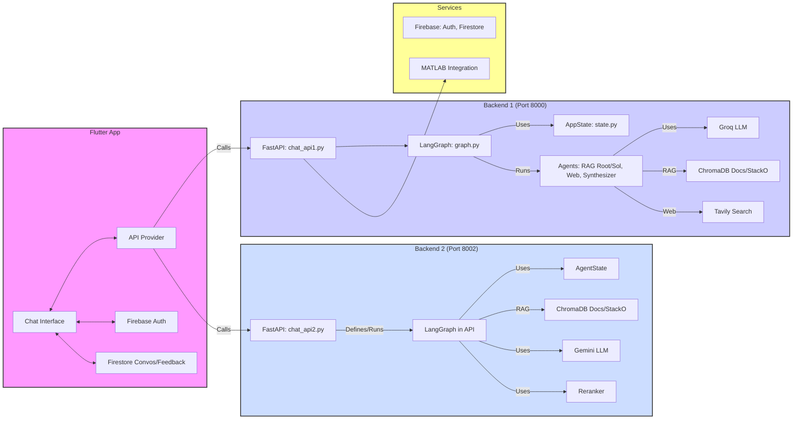

# MatFixer: AI-Powered MATLAB Troubleshooter

This repository contains the code for MatFixer, an AI-powered system that assists users in diagnosing and fixing issues in their MATLAB code. It features a multi-agent architecture built using LangGraph, FastAPI for the backend, and a Flutter frontend.

## Architecture Overview

The system follows a multi-agent workflow orchestrated by LangGraph:

1. **User Query:** The user submits a query or describes a MATLAB problem through the Flutter application.
2. **Backend API:** The Flutter app communicates with a FastAPI backend (`Backend1` or `Backend2`).
3. **LangGraph Workflow (Backend1 - Advanced):**
    * The query is processed to define the core problem.
    * Multiple agents run in parallel to gather information:
        * **RAG Agents:** Search internal knowledge bases (built from MATLAB docs, Stack Overflow dumps stored in ChromaDB) for potential root causes and solutions.
        * **Web Search Agent:** Searches the web (using Tavily) for broader context or recent solutions.
    * **Synthesizer:** Results from the RAG and web agents are synthesized into a coherent analysis, including root cause and proposed solutions, formatted in Markdown.
4. **LangGraph Workflow (Backend2 - Simpler RAG):**
    * Provides a direct RAG pipeline using ChromaDB and a Gemini LLM to generate answers with citations based on the knowledge bases.
5. **Response:** The backend returns the synthesized report or direct answer as a JSON response.
6. **Frontend Display:** The Flutter application displays the response to the user in a chat interface.
7. **Feedback:** Users can provide feedback on the generated solutions, which is stored via Firebase for potential future improvements. An Admin dashboard allows viewing this feedback.
8. **MATLAB Integration (Conceptual):** The architecture includes a provision for integrating with MATLAB directly (e.g., via the MATLAB Engine API for Python) for verification, though the primary implementation focuses on providing code suggestions and explanations.



## Project Structure

* **/Backend1**: Contains the primary, more complex FastAPI backend using LangGraph with separate agent nodes, Groq LLM, ChromaDB, and Tavily web search.
* **/Backend2**: Contains a simpler, alternative FastAPI backend using LangGraph directly within the API file, leveraging Gemini LLM and ChromaDB for RAG.
* **/app**: Contains the Flutter frontend application for user interaction, conversation management, and feedback.

## Key Technologies

* **Frontend:** Flutter, Provider
* **Backend:** Python, FastAPI, Uvicorn
* **Orchestration:** LangGraph
* **AI/LLM:** LangChain, Google Gemini, Groq (Llama 3), Sentence Transformers (Embeddings, Reranking)
* **Vector Store:** ChromaDB
* **Web Search:** Tavily Search API
* **Persistence:** Firebase (Firestore for conversations/feedback, Auth for users)

## Setup and Installation

1. **Clone the Repository:**

    ```bash
    git clone https://github.com/AmanSikarwar/matfixer
    cd matfixer
    ```

2. **Setup Backend1:** See `Backend1/README.md`. Requires Python, pip, and API keys for Groq and Tavily in a `.env` file.
3. **Setup Backend2:** See `Backend2/README.md`. Requires Python, pip, and a Google Gemini API Key (currently hardcoded - **improvement needed**).
4. **Setup Flutter App:** See `app/README.md`. Requires Flutter SDK and Firebase project setup. Update backend URLs in `app/lib/providers/fast_api_llm_provider.dart` if necessary.

## Running the Application

1. **Start Backend1:**

    ```bash
    cd Backend1
    # Activate virtual environment
    uvicorn chat_api1:app --host 0.0.0.0 --port 8000 --reload
    ```

2. **Start Backend2:**

    ```bash
    cd Backend2
    # Activate virtual environment
    uvicorn chat_api2:app --host 0.0.0.0 --port 8002 --reload
    ```

    *(Note: Backend2 also contains `smartapi.py` running on port 8001, which might be an alternative endpoint not directly used by the main app flow)*
3. **Run Flutter App:**

    ```bash
    cd app
    flutter run -d <chrome|macos|windows>
    ```

Refer to the README files within each subdirectory (`Backend1`, `Backend2`, `app`) for more detailed instructions.
